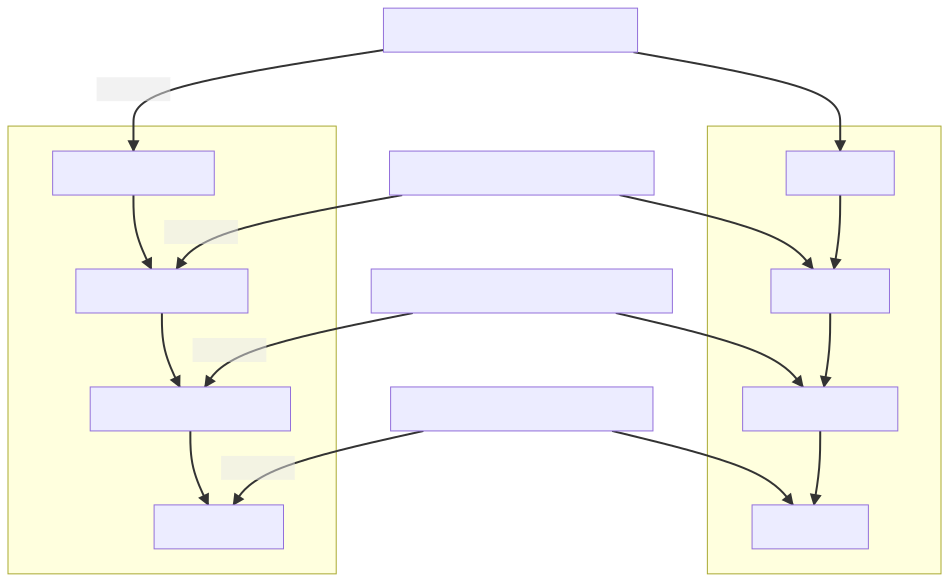
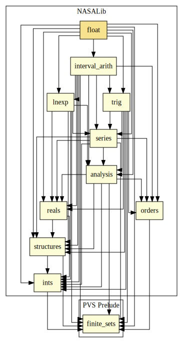

# Floating-Point Library

This library contains several formalizations of floating-point numbers.

* *IEEE 754*: Axiomatic formalization that complies with the IEEE 754 standard
* *IEEE 854*: A low-level foundational formalization following IEEE 854 Standard
* *High-level*: A general high-level formalization that is proven to interpret correctly the axiomatic IEEE 754 formalization. It is also proven that a reduced version is equivalent to the IEEE 854 specification.

## Axiomatic Formal Description of the IEEE 754 Standard
*Contact:* Mariano Moscato, NIA, USA

This library presents an axiomatic formalization of the floating-point numbers defined in the 754 standard by IEEE. The formalization is parametric in the values that define a specific format according to the standard: _radix_ (`b`), _precision_(`p`), and _maximum exponent_(`emax`). It accepts the values defined by the standard.

|        | binary32 | binary64 | binary128 | decimal64 | decimal128
| ------ | :-:   | :-:       | :-:         | :-: | :-: |
| `b`    |  2       | 2        | 2         | 10  | 10 |
| `p`    |  24      | 53       | 113       | 16  | 34 |
| `emax` | 127      | 1023     | 16383     | 384 | 6144 |

These parameters are present in every theory defining general aspects of the floating-point values.
Some example instantiations for specific formats are provided in the theories:

*  `ieee754_single` for _binary32_, and
*  `ieee754_double` for _binary64_.

There, definitions for the specifically instantiated floating-point datatype as well as for the operations are provided by convenience of the user.

Several operations on floating-point data are axiomatized accordingly to the standard.
At the moment, support for the following operations is provided:

* `ieee754_qlt`: quiet less than
* `ieee754_qle`: quiet less or equal than
* `ieee754_qgt`: quiet greater than
* `ieee754_qgt`: quiet greater or equal than
* `ieee754_qeq`: quiet equal to
* `ieee754_qun`: quiet unordered
* `ieee754_add`: addition
* `ieee754_sub`: subtraction
* `ieee754_div`: division
* `ieee754_mul`: multiplication 
* `ieee754_max`: maximum (of two numbers)
* `ieee754_min`: minimum (of two numbers)
* `ieee754_abs`: absolute value
* `ieee754_sqt`: square root

Nevertheless, flags and exceptions are not currently supported.

The theory `ieee754_data` contains fundamental declarations and properties, such as the datatype denoting floating-point data and its special values (_NaN_, _infinites_, _zeros_). Properties of the fragment of the real numbers being represented by floating-point numbers are provided in the theory `ieee754_domain`. The connection between both theories is established in `ieee754_semantics` where notions such as rounding and projection are axiomatized.

The theory hierarchy is shown below. The arrows depicts importing relations.


where `op` = `add` | `sub` | `mul` | `div` | `max` | `min` | `abs` | `sqt` | `qlt` | `qle` | `qgt` | `qge` | `qeq` | `qun`.

## Low-level Formalization of IEEE 854 Floating-Point Numbers
*Author:* Paul Miner, NASA, LaRC

This is a hardware level model of floating-point numbers as described by the IEEE 854 Standard. See [5] for details.

## High-level Formalization of Floating Point Numbers 
*Contact:* Mariano Moscato, NIA, USA

This formalization was initiated by Sylvie Boldo (ENS-Lyon) [1,2]
while visiting the National Institute of Aerospace (NIA) in late 2005.
It was augmented by Mariano Moscato (NIA, 2016) in order to provide support for roundoff error calculations, serving as the formal support for the certificates generated by PRECiSA [3].

In mid 2019, Mariano Moscato introduced an extension of this formalization incorporating special values to the representation, namely infinities, not-a-number values, and signed zeros. 
This extension is parametric on the following values, which determine an specific representation format (see [2] for details).

* `radix` integer greater than 0
* `precision` integer greater than 0
* `dExp` integer greater than `2*(precision-1) - 1`

Note that formats equivalent to the ones defined by the IEEE 754
standard can be set by using the values shown in the table below. 

|             | single precision | double precision |
| ----------- | :--------------: | :--------------: |
| `radix`     | 2                | 2                |
| `precision` | 24               | 53               |
| `dExp`      | 149              | 1074             |

Instantiations for these formats are provided in the theories `single`
and `double`. These theories should serve as the entry point to users
needing to manipulate a particular format. 

### Core of the extension

The basic declarations such as the datatype denoting floating-point
numbers, the set of reals being exactly represented by them, and the
projection and rounding functions are defined in the theories:
`extended_float`, `extended_float_exactly_representable_reals`, and
`extended_float_rounding`. 

Each supported operation is defined in a separate theory:

* `extended_float_qlt`  : quiet less-than comparison
* `extended_float_qgt`  : quiet greater-than comparison
* `extended_float_qle`  : quiet less-or-equal-than comparison
* `extended_float_qge`  : quiet greater-or-equal-than comparison
* `extended_float_qeq`  : quiet equal-to comparison
* `extended_float_qun`  : quiet unordered comparison
* `extended_float_add`  : addition
* `extended_float_sub`  : subtraction
* `extended_float_mul`  : multiplication
* `extended_float_div`  : division
* `extended_float_max`  : maximum of two values
* `extended_float_min`  : minimum of two values
* `extended_float_sqt`  : square root
* `extended_float_abs`  : absolute value

These theories depends on `ieee754_operation_scheme__binary`,
`ieee754_operation_scheme__unary`, and
`ieee754_predicate_scheme__binary`, which defines how an arbitrary
function or predicate on floating-points should be defined according 
to the IEEE754 standard. 

### Interpretation of the Axiomatic IEEE 754 Formalization

The theory `extended_float_exactly_representable_reals` shows that the `extended_float.efloat` datatype can represent the fragment of the real numbers described in `ieee754_domain`.

The theory-interpretation feature provided by PVS [4] is used to prove
that the single and double precision instantiations (`single` and
`double`) are correct implementations of the model determined by the
axiomatic formalization of floating-point numbers accompanying this
library. The interpretation is performed by levels as depicted in the diagram below.



Arrows denotes an explicit dependency (importing) between theories. Actual parameters (of any) of each importing are indicated on the corresponding arrow. The abbreviation _<op>_ stands for each of the operations mentioned above.

## Rerunning the Proofs

Example run:
````shell
$ time proveit -a top.pvs 
Processing ./top.pvs. Writing output to file ./top.summary
Grand Totals: 2108 proofs, 2108 attempted, 2108 succeeded (638.34 s)

real	15m40.348s
user	16m15.372s
sys	0m8.613s
````
_Configuration:_ macOS 10.13.6, 2.7 GHz i7, 16 GB 2133 MHz LPDDR3.


# Contributors
* [Mariano Moscato](https://www.nianet.org/directory/research-staff/mariano-moscato/), NIA & NASA, USA
* [Paul Miner](http://shemesh.larc.nasa.gov/people/psm), NASA, USA
* [Sylvie Boldo](https://www.lri.fr/~sboldo), INRIA, France
* [César Muñoz](http://shemesh.larc.nasa.gov/people/cam), NASA, USA
* [Sam Owre](http://www.csl.sri.com/users/owre), SRI, USA

## Maintainer
* [Mariano Moscato](https://www.nianet.org/directory/research-staff/mariano-moscato/), NIA & NASA, USA

# Dependencies

* Library level



* Theory level


## References

[1] S. Boldo, [Preuves formelles en arithmétiques a virgule flottante](http://www.ens-lyon.fr/LIP/Pub/Rapports/PhD/PhD2004/PhD2004-05.pdf), PhD. Thesis, Ecole Normale Supérieure de Lyon, 2004.

[2] Sylvie Boldo and César Muñoz. (2006). [A High-Level Formalization of Floating-Point Numbers in PVS](https://shemesh.larc.nasa.gov/people/cam/publications/NASA-CR-2006-214298.pdf). Contractor Report NASA/CR-2006-214298. NASA Langley Research Center, Hampton VA 23681-2199, USA.

[3] Moscato, M., Titolo, L., Dutle, A., & Munoz, C. A. (2017). [Automatic estimation of verified floating-point round-off errors via static analysis](https://ntrs.nasa.gov/archive/nasa/casi.ntrs.nasa.gov/20170009111.pdf). In International Conference on Computer Safety, Reliability, and Security (pp. 213-229). Springer, Cham.

[4] Owre, Sam, Natarajan Shankar, and Ricky W. Butler. (2001). [Theory interpretations in PVS](https://ntrs.nasa.gov/archive/nasa/casi.ntrs.nasa.gov/20010066742.pdf). ContractorReport NASA/CR-2001-211024. NASA Langley Research Center, Hampton VA23681-2199, USA.

[5] P. Miner, [Defining the IEEE-854 floating-point standard in PVS](http://techreports.larc.nasa.gov/ltrs/dublincore/1995/NASA-95-tm110167.html), NASA/TM-95-110167, NASA Langley Research Center, 1995.

---

[*] This work has been partially funded by NASA LaRC under the Research Cooperative Agreement No. NCC-1-02043 awarded to the National Institute of Aerospace, and the French CNRS under PICS 2533 awarded to the Laboratoire de l'Informatique du Parallélisme.
